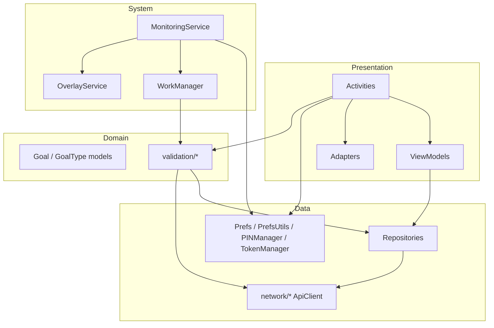
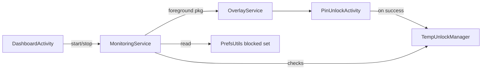
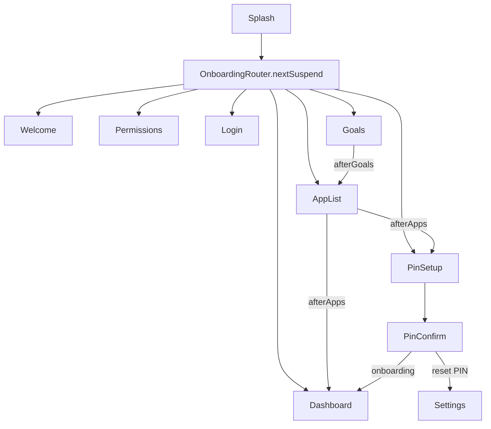
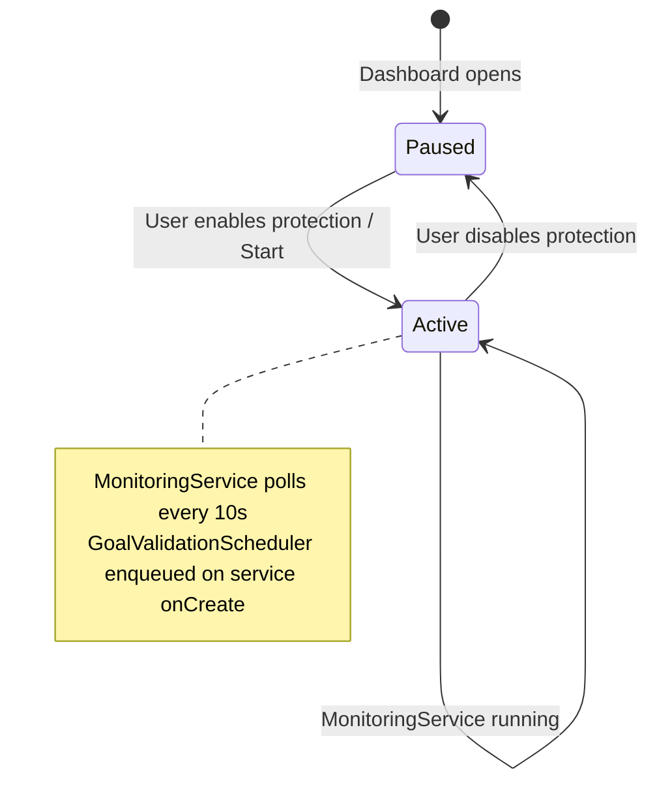

# Android — Architecture

Layered architecture with Activities + ViewModels, repository pattern for API access, and foreground services for blocking and scheduled validation.

---

## Layer diagram

---

## Package responsibilities

### `activity/`

| Activity | Purpose |
|----------|---------|
| `SplashActivity` | Launcher; resolves next screen |
| `WelcomeActivity` | First-run intro |
| `PermissionsActivity` | Runtime + special permissions |
| `LoginActivity` / `RegisterActivity` | Auth |
| `GoalsActivity` | Onboarding goal creation |
| `AppListActivity` | Onboarding blocked-app picker |
| `PinSetupActivity` / `PinConfirmActivity` | PIN create / confirm |
| `PinUnlockActivity` | Verify PIN (overlay unlock or reset flow) |
| `DashboardActivity` | Main hub, protection, manual poll |
| `SettingsActivity` | Goals, apps, preferences, reset PIN, logout |
| `UserPreferenceActivity` | Legacy/alternate preferences screen |

### `repository/`

| Repository | Backend endpoints |
|------------|-------------------|
| `AuthRepository` | `/api/auth/login`, `/register` |
| `GoalsRepository` | `/api/goals/*` |
| `BlockedAppsRepository` | `/api/user/me/blocked-apps` |
| `DashboardRepository` | `/api/dashboard` |
| `AppRepository` | Local installed apps (PackageManager) |

### `services/`

| Service | Type | Role |
|---------|------|------|
| `MonitoringService` | Foreground | Poll foreground app every 10s; start overlay; schedule goal validation on start |
| `OverlayService` | Background | Full-screen block UI over blocked app |
| `PINManager` | Utility | EncryptedSharedPreferences for PIN |
| `Prefs` | Utility | Onboarding flags, delegates blocked set to `PrefsUtils` |

### `validation/`

| Class | Role |
|-------|------|
| `GoalValidator` | Window calculation, call LeetCode, PATCH/complete goal |
| `LeetCodeValidator` | GraphQL client |
| `GoalValidationScheduler` | WorkManager one-time jobs (T−6h hourly + countdown) |
| `GoalValidationWorker` | Runs validation for active LeetCode goals |
| `ManualValidationLimiter` | 1 manual poll per hour |

### `utils/`

| Utility | Role |
|---------|------|
| `OnboardingRouter` | Navigation state machine |
| `PermissionGuard` / `PermissionUtils` | Permission checks |
| `PrefsUtils` | Blocked apps set, display name, platform usernames |
| `TempUnlockManager` | Per-app 5-minute unlock expiry |
| `AuthFormHelper` | Login/register button enablement |
| `PinKeypadController` | Shared PIN keypad UI logic |

---

## Component diagram (blocking)

---

## Component diagram (navigation)

`resolvePostAuth` uses: goals empty → Goals; `!isAppSelectionDone()` → AppList; no PIN → PinSetup; else Dashboard.

---

## State: protection mode

---

## ViewModels

### `GoalsViewModel`

- `allGoals`, `allBlockedApps` LiveData
- CRUD wrappers around repositories
- `refreshDashboard()` → single GET `/api/dashboard`
- Does **not** run validation (except Dashboard triggers validator separately)

### `AuthViewModel`

- `login`, `register`, `logout`
- Exposes `authResult: LiveData<AuthOutcome>`

---

## WorkManager

- Auto-init **disabled** in manifest; configured in `ObliqueApp`.
- Tag: `goal_validation`
- Cancelled in `MonitoringService.onDestroy()`

---

## Security notes

- JWT: `TokenManager` → EncryptedSharedPreferences
- PIN: `PINManager` → separate encrypted prefs file
- PIN is **not** sent to backend for device unlock (server may store optional hashed PIN on register — device flow uses local PIN)

See [data-storage.md](data-storage.md).

---

## Known limitations

Documented in [goal-validation.md](goal-validation.md) and system overview:

- Duolingo goals not validated
- Blocking not tied to goal completion
- Validation scheduling only when protection service starts
- LeetCode submission list capped at 50 recent entries
