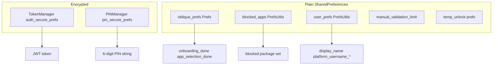

# Android — Local data & security

Where the app persists state on device and how sensitive data is protected.

---

## Storage map

---

## `Prefs` (`oblique_prefs`)

| Key | Type | Purpose |
|-----|------|---------|
| `onboarding_done` | boolean | Welcome completed |
| `app_selection_done` | boolean | User confirmed app list in onboarding |
| `migrated_blocked_apps_v1` | boolean | Legacy migration flag |

**Migration:** On init, migrates legacy `selected_apps` string set into `PrefsUtils` blocked set.

**Migration:** If PIN already set and `app_selection_done` missing, marks app selection done (upgrade path).

---

## `PrefsUtils`

### Blocked apps (`blocked_apps` / `pkgs`)

- Canonical local blocklist for `MonitoringService`.
- Synced to backend on AppList confirm and Settings save.
- Also exposed via `Prefs.getSelectedApps()` / `setSelectedApps()` (delegates here).

### User prefs (`user_prefs`)

| Key pattern | Content |
|-------------|---------|
| `display_name` | User display name |
| `platform_username_{platform}` | e.g. `platform_username_leetcode` |

Populated from onboarding router token validation and Settings save.

---

## `TokenManager`

- **File:** encrypted `auth_secure_prefs`
- **Key:** `auth_token`
- **Master key alias:** `auth_master_key_alias`
- Migrates from legacy `secure_prefs` if needed
- Used by `ApiClient` interceptor for `Authorization: Bearer …`
- Cleared on logout and 401 from splash validation

---

## `PINManager`

- **File:** encrypted `pin_secure_prefs`
- **Key:** `user_pin`
- **APIs:** `savePin`, `getPin`, `verifyPin`, `isPinSet`, `clearPin`
- Device unlock and Settings reset flow use this store
- **Not** the same as optional server-side hashed PIN on user register

---

## `TempUnlockManager`

- Stores per-package unlock expiry timestamps (SharedPreferences).
- Default duration: **5 minutes** after successful PIN in `PinUnlockActivity`.
- Checked by `MonitoringService` before showing overlay.

---

## `ManualValidationLimiter`

- SharedPreferences key tracks last manual poll time.
- Enforces **1 trigger per 60 minutes** on Dashboard.

---

## Network configuration

- `android/local.properties` → `BuildConfig.API_BASE_URL`
- Cleartext permitted for dev (`usesCleartextTraffic`, `network_security_config`)

---

## Permissions (runtime / special)

| Permission | Checked in | Required for |
|------------|------------|--------------|
| `PACKAGE_USAGE_STATS` | `PermissionUtils` | Foreground app detection |
| `SYSTEM_ALERT_WINDOW` | `PermissionUtils` | Overlay block screen |
| `POST_NOTIFICATIONS` | `PermissionUtils` (API 33+) | Foreground service notification |
| `INTERNET` | Manifest | API + LeetCode GraphQL |

`PermissionGuard.ensureGranted()` redirects protected screens to `PermissionsActivity`.

Protected screens (call `ensureGranted` in `onResume`): Goals, AppList, Dashboard, Settings, PinSetup, PinConfirm, UserPreference — **not** PinUnlock (overlay context).

---

## Data not stored locally

- Full goal history / audit (`GoalCheckHistory` is server-only)
- Room database (removed; API-only architecture)
- LeetCode submission cache between validation runs

---

## Sign out behavior

`AuthRepository.logout()`:

- Clears JWT via `TokenManager`
- Navigates to Login with `CLEAR_TASK`
- Does **not** clear PIN or blocked apps by default (device-level settings persist)
