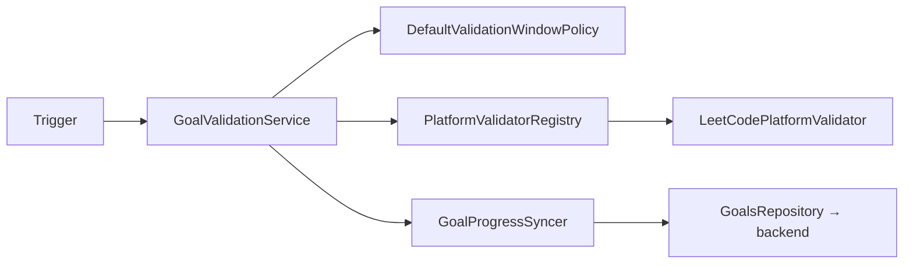
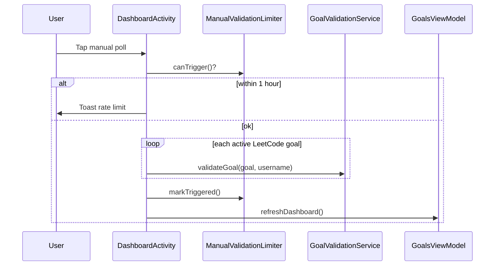

# Android — Goal validation

How the app checks LeetCode progress and syncs results to the backend. **Duolingo is not implemented.**

See also: [Goal validation architecture](../architecture/goal-validation.md) | [Adding a platform](./adding-a-platform.md)

---

## Overview



---

## Triggers

| Trigger | Location | Conditions |
|---------|----------|------------|
| Scheduled | `GoalValidationScheduleManager` → `GoalValidationWorker` | Protection ON; active LeetCode goals; network available |
| Manual poll | `DashboardActivity` manual poll button | LeetCode username in prefs; `ManualValidationLimiter` (1/hour) |

**Not triggered by:** dashboard open or settings save alone.

### Scheduling lifecycle

1. Goal create/update/delete → `GoalsViewModel` → `GoalValidationScheduleManager.scheduleGoal()` / `cancelGoal()`
2. Protection enabled → `DashboardActivity` → `refreshForGoals()`
3. Protection disabled → `cancelAll()`
4. Each WorkManager job carries `EXTRA_GOAL_ID` and validates **one** goal via `GoalValidationService`

`MonitoringService` handles app blocking only — it does **not** schedule validation.

---

## Validation window

Implemented in `DefaultValidationWindowPolicy`:

| Condition | Window start | Window end |
|-----------|--------------|------------|
| `deadline <= 0` | Start of today (local midnight) | `now` |
| Else | Start of deadline's calendar day | `min(deadline, now)` |

If `start >= end`, validation is skipped.

---

## Platform validators

### LeetCodePlatformValidator

- GraphQL `recentAcSubmissionList` with a single request (limit up to 3×50 submissions; API has no offset/cursor)
- Retry on transient failures (2 attempts)
- Structured failure codes via `ValidationConstants`
- Usernames redacted in logs (`LeetCodePlatformValidator.redactUsername()`)

### DuolingoPlatformValidator

Stub — returns `Failure(UNSUPPORTED)`.

---

## Backend sync

`GoalProgressSyncer` calls `GoalsRepository` without mutating the local `Goal` object:

| Outcome | API |
|---------|-----|
| Progress changed, below target | `PATCH /api/goals/:id/progress` with `{ progress, evidence? }` |
| Progress ≥ target | `POST /api/goals/:id/complete` with `{ completedAt, evidence? }` |
| Unchanged | No API call |

Backend rejects progress regression and updates on completed goals.

---

## Username source

```kotlin
PrefsUtils.getPlatformUsername(context, PlatformConstants.KEY_LEETCODE)
```

Platform keys are normalized via `PlatformConstants.normalizePlatform()`.

---

## Manual poll flow



User-facing toasts live in `strings.xml` (`manual_validation_*`).

---

## Platform support matrix

| Platform | Create goal | Validate | Scheduler | Manual poll |
|----------|-------------|----------|-----------|-------------|
| LeetCode | Yes | Yes | Yes | Yes |
| Duolingo | Yes | No (UNSUPPORTED) | No | No |

---

## Class reference

| File | Responsibility |
|------|----------------|
| `validation/GoalValidationService.kt` | Orchestration |
| `validation/platform/LeetCodePlatformValidator.kt` | LeetCode GraphQL |
| `validation/platform/PlatformValidatorRegistry.kt` | Validator lookup |
| `validation/platform/GoalProgressSyncer.kt` | Backend sync |
| `validation/GoalValidationWorker.kt` | WorkManager worker (one goal) |
| `validation/GoalValidationScheduler.kt` | Unique work enqueue |
| `validation/GoalValidationScheduleManager.kt` | CRUD + protection hooks |
| `validation/ManualValidationLimiter.kt` | SharedPrefs rate limit |
| `utils/PlatformCatalog.kt` | Platform list single source |
| `utils/ValidationConstants.kt` | Work tags, error codes |

---

## Unit tests

Located under `app/src/test/java/.../validation/`:

- `PlatformValidatorRegistryTest`
- `DefaultValidationWindowPolicyTest`
- `GoalProgressSyncerTest`
- `GoalValidationServiceTest`
