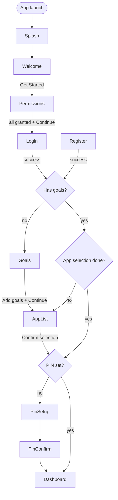
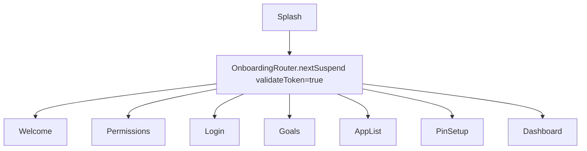
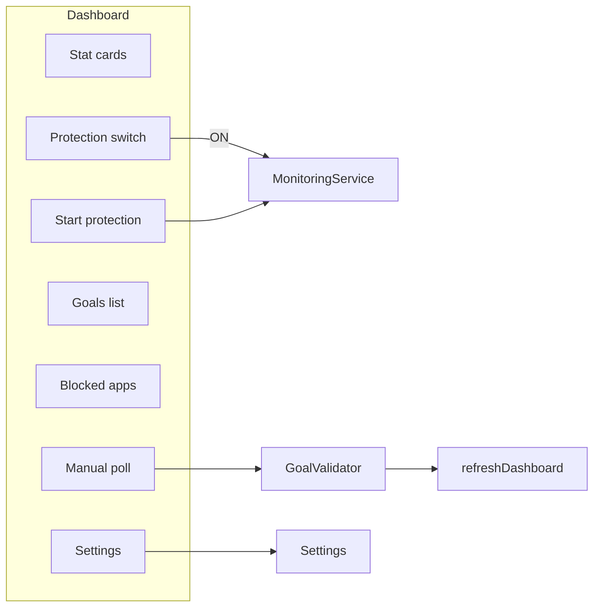
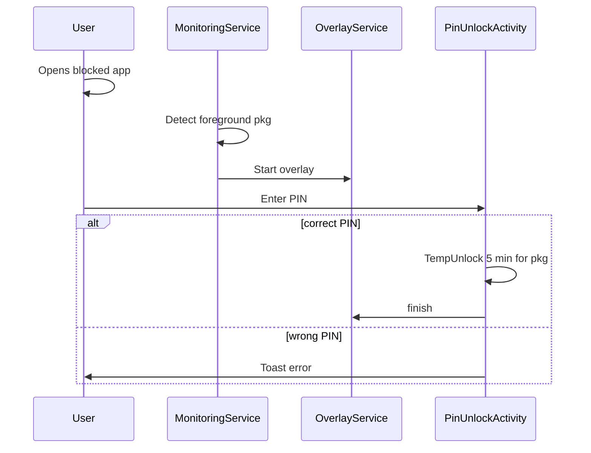
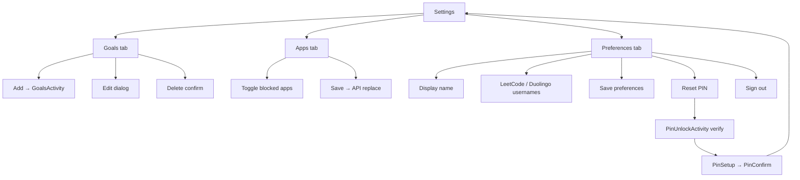
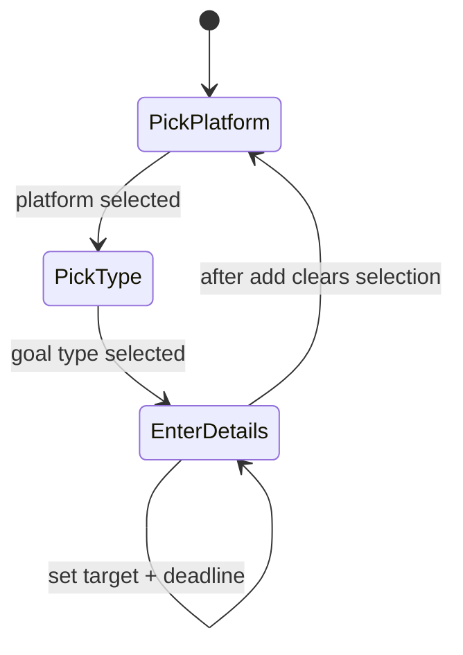

# Android — UI flows

Screen-by-screen navigation and user actions. All onboarding resume logic is centralized in `OnboardingRouter`.

---

## Onboarding (first install)

### Step details

| Step | Screen | User action | System behavior |
|------|--------|-------------|-----------------|
| 1 | Welcome | Tap **Get Started** | `Prefs.onboardingDone = true` → Permissions |
| 2 | Permissions | Grant usage, overlay, notifications | Success banner when all granted; Continue → `nextSuspend()` |
| 3 | Login / Register | Email + password | JWT stored; navigate via `nextSuspend()` |
| 4 | Goals | Pick platform → type → target → deadline → **Add Goal** | POST `/api/goals`; enable Continue when ≥1 goal |
| 5 | App list | Search/select apps → **Confirm** | PUT blocked apps; `appSelectionDone = true` |
| 6 | PIN setup | Enter 6 digits | → Confirm screen |
| 7 | PIN confirm | Re-enter PIN | Save encrypted PIN → Dashboard |

---

## Cold start (returning user)

`SplashActivity` validates JWT against `GET /api/user/me` when online; 401 clears token → Login.

---

## Dashboard

| Element | Behavior |
|---------|----------|
| Protection switch | Starts/stops `MonitoringService`; requires permissions |
| Start protection | Same as enabling switch |
| Manual poll | Validates active LeetCode goals; **1/hour** (`ManualValidationLimiter`) |
| Stats | Apps blocked count, goals done, success rate from ViewModel |

---

## App blocking overlay

---

## Settings

Three tabs: **Goals**, **Apps**, **Preferences**.

### Reset PIN flow

1. User taps **Reset PIN** (Preferences).
2. If no PIN: toast and stop.
3. `PinUnlockActivity` with `EXTRA_VERIFY_FOR_RESET` — verify current PIN.
4. `PinSetupActivity` → `PinConfirmActivity` with `EXTRA_RESET_PIN`.
5. On confirm: save PIN, toast, return to Settings (no Dashboard redirect).

---

## Auth screens

### Login

- Fields: email, password (toggle visibility).
- Button enabled when both non-empty (`AuthFormHelper`).
- Enabled state: green; disabled: gray selector.

### Register

- Fields: name, email, password, confirm password.
- Button enabled when all valid: password ≥8 chars, passwords match.

---

## Permissions screen

| Permission | How granted |
|------------|-------------|
| Overlay | `SYSTEM_ALERT_WINDOW` → Settings intent |
| Usage access | `PACKAGE_USAGE_STATS` → Settings intent |
| Notifications | `POST_NOTIFICATIONS` runtime (API 33+) |

Continue button label toggles **Grant permissions** vs **Continue** based on `PermissionUtils.hasRequiredPermissions()`.

Green success banner visible only when all granted.

---

## Goals creation (progressive UI)

Sections `sectionGoalType` and `sectionGoalDetails` reveal progressively in `GoalsActivity`.

---

## Activity ↔ layout map

| Activity | Layout |
|----------|--------|
| `SplashActivity` | (no layout — immediate redirect) |
| `WelcomeActivity` | `activity_welcome.xml` |
| `PermissionsActivity` | `activity_permissions.xml` |
| `LoginActivity` | `activity_login.xml` |
| `RegisterActivity` | `activity_register.xml` |
| `GoalsActivity` | `activity_goals.xml` |
| `AppListActivity` | `activity_app_list.xml` |
| `PinSetupActivity` / `PinConfirmActivity` | `activity_pin_setup.xml`, `include_pin_screen.xml` |
| `PinUnlockActivity` | `activity_pin_unlock.xml` |
| `DashboardActivity` | `activity_dashboard.xml` |
| `SettingsActivity` | `activity_settings.xml` |
