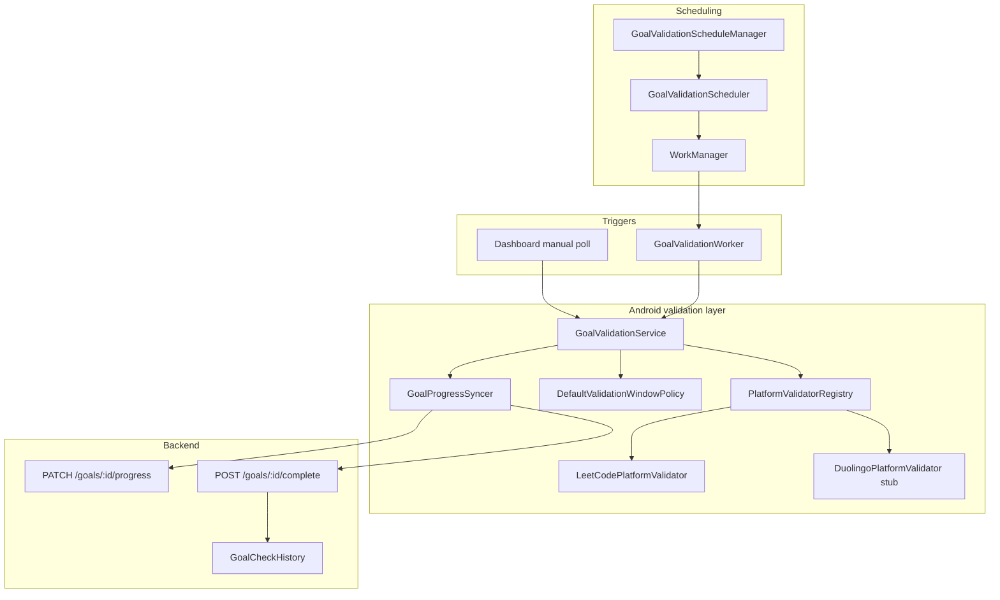

# Goal validation architecture

End-to-end view of how Oblique validates goals, syncs progress to the backend, and schedules checks.

---

## Components

---

## Separation of concerns

| Layer | Responsibility |
|-------|----------------|
| `MonitoringService` | App blocking only — no validation scheduling |
| `GoalValidationScheduleManager` | Enqueue/cancel WorkManager jobs on goal CRUD and protection toggle |
| `GoalValidationService` | Orchestrate window → validator → syncer for one goal |
| `PlatformGoalValidator` | Platform-specific external API checks |
| `GoalProgressSyncer` | PATCH progress or POST complete via `GoalsRepository` (no optimistic local mutation) |
| Backend `goals.service` | Persist progress, reject regression, idempotent completion history |

---

## Validation window

`DefaultValidationWindowPolicy` computes the local calendar-day window:

| Condition | Start | End |
|-----------|-------|-----|
| `deadline <= 0` | Midnight today | `now` |
| Else | Midnight on deadline day | `min(deadline, now)` |

Invalid windows (`start >= end`) skip validation.

---

## Backend safety rules

Implemented in `backend/src/services/goals.service.ts`:

1. **Progress regression** — `computedProgress` must be ≥ current `goal.progress` (unless already completed)
2. **Completed goals** — PATCH progress and PUT goal fields rejected when `status === 'completed'`
3. **Idempotent complete** — `GoalCheckHistory` written only on first transition to completed
4. **lastCheckedAt** — updated on every progress PATCH
5. **Evidence** — optional JSON on progress and complete endpoints

Rate limiting: `POST .../complete` and `PATCH .../progress` are rate-limited per route config.

---

## Scheduling lifecycle

1. User creates/updates/deletes goal → `GoalsViewModel` → `GoalValidationScheduleManager`
2. User enables protection → `DashboardActivity` → `refreshForGoals()`
3. User disables protection → `cancelAll()`
4. Each slot → `GoalValidationWorker` with `EXTRA_GOAL_ID` → `GoalValidationService.validateGoalById()`

Work names are unique per goal+slot via `WorkConstants.uniqueWorkName()`.

---

## Observability gaps (documented)

| Event | Android | Backend history |
|-------|---------|-----------------|
| Progress updated | Log + dashboard refresh on manual poll | `lastCheckedAt` set |
| Goal completed | Log | `GoalCheckHistory` (once) |
| No change | Log at debug | Not recorded (future) |
| Validation error | Log with code | Not recorded (future) |

Future work: record no-change/error checks in `GoalCheckHistory` from the syncer path when backend support is added.

---

## Related docs

- [Android goal validation](../android/goal-validation.md)
- [Adding a platform](../android/adding-a-platform.md)
- [Backend API reference](../backend/api-reference.md)
