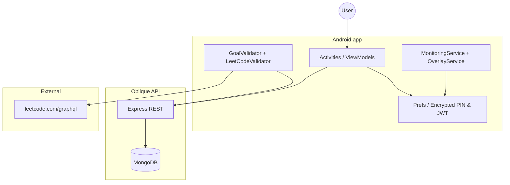
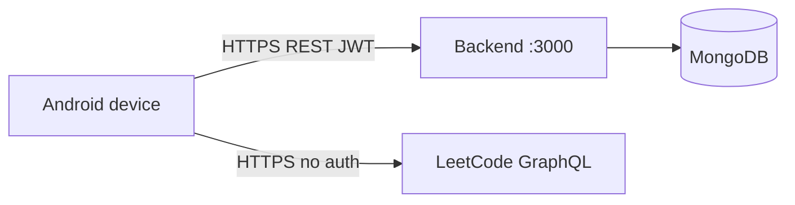
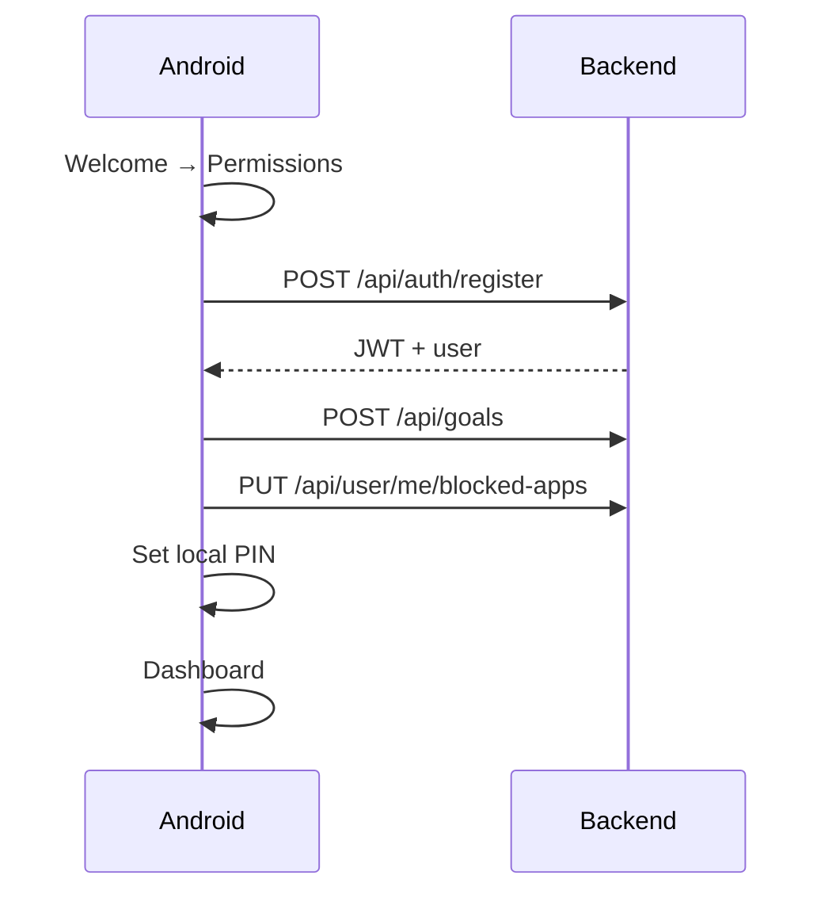
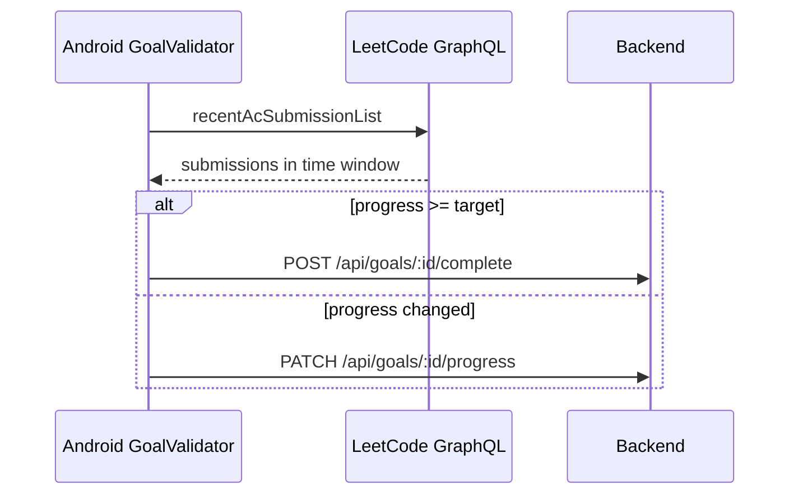
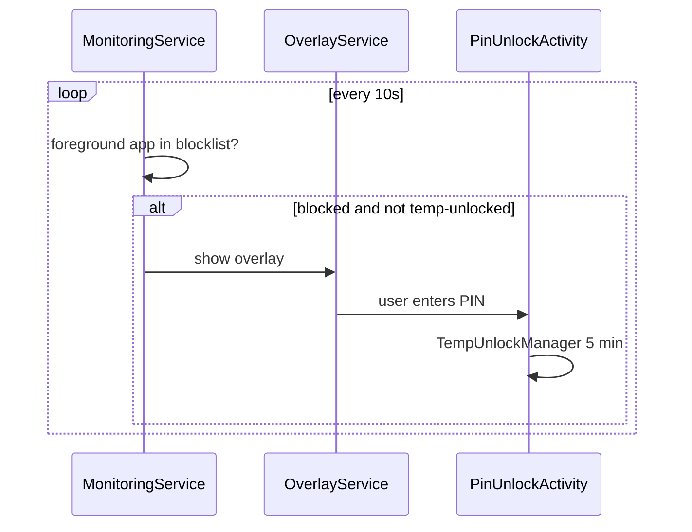

# System overview (HLD)

High-level design for the **Regretnt / Oblique** stack: native Android client and Node.js API.

---

## Purpose

Help users stay accountable by:

1. **Setting daily goals** tied to learning platforms (LeetCode, Duolingo in UI).
2. **Blocking selected apps** when “protection” is enabled.
3. **Validating LeetCode progress** on the device and syncing results to the cloud.
4. **Temporary unlock** via a local 6-digit PIN (5 minutes per blocked app).

The backend is the **system of record** for users, goals, blocked apps, and preferences. Platform activity verification runs **only on Android** (LeetCode GraphQL today).

---

## Context diagram

---

## Trust boundaries

| Data / action | Source of truth | Verified by |
|---------------|-----------------|-------------|
| User credentials | Backend (bcrypt password) | Login/register |
| JWT session | Backend issues; Android `TokenManager` stores encrypted | `requireAuth` middleware |
| Goals & progress | Backend MongoDB | Client reports progress; **not** re-verified server-side |
| LeetCode solves | LeetCode API | Android `LeetCodeValidator` |
| Blocked app list | Backend User doc + local `PrefsUtils` cache | Sync on confirm/save |
| Device unlock PIN | Android `PINManager` (EncryptedSharedPreferences) | Local only |
| Temp unlock window | Android `TempUnlockManager` | Local only |

---

## Deployment topology

**Android API URL:** `BuildConfig.API_BASE_URL` from `android/local.properties` (`API_BASE_URL`).

**Emulator → host:** `http://10.0.2.2:3000/`  
**Physical device:** `http://<LAN-IP>:3000/`

---

## Major subsystems

### Android

| Subsystem | Entry points | Responsibility |
|-----------|--------------|----------------|
| Onboarding | `SplashActivity`, `OnboardingRouter` | Route user to first incomplete step |
| Auth | `LoginActivity`, `RegisterActivity`, `AuthRepository` | JWT acquisition |
| Permissions | `PermissionsActivity`, `PermissionGuard` | Usage stats, overlay, notifications |
| Goals UI | `GoalsActivity`, `SettingsActivity` | Create/edit goals |
| Dashboard | `DashboardActivity`, `GoalsViewModel` | Stats, protection toggle, manual poll |
| App blocking | `MonitoringService`, `OverlayService`, `PinUnlockActivity` | Foreground detection, overlay, PIN unlock |
| Goal validation | `GoalValidationWorker`, `GoalValidator` | Scheduled + manual LeetCode checks |

See [Android architecture](../android/architecture.md).

### Backend

| Subsystem | Routes | Responsibility |
|-----------|--------|------------------|
| Auth | `/api/auth/*` | Register, login, JWT |
| User | `/api/user/me/*` | Profile, preferences, blocked apps |
| Goals | `/api/goals/*` | CRUD, progress, complete |
| Dashboard | `/api/dashboard` | Aggregated goals + blocked apps |

See [Backend architecture](../backend/architecture.md).

---

## Key integration flows

### 1. Registration & onboarding

### 2. Goal validation (LeetCode)

### 3. App blocking (independent of goals)

**Important:** Goal completion does **not** automatically unblock apps in the current implementation.

---

## Non-goals (current MVP)

- Server-side LeetCode/Duolingo verification
- Duolingo validation on Android
- Goal-gated app blocking (blocking uses PIN only)
- iOS client
- React Native active client (`mobile/` is not wired to this backend flow)

---

## Glossary

| Term | Meaning |
|------|---------|
| Protection | User-enabled monitoring via `MonitoringService` foreground service |
| Temp unlock | 5-minute bypass for one blocked app after correct PIN |
| Baseline | `baselineValue` on goal; progress = reported value − baseline |
| App selection done | Local pref set when user confirms blocked apps in onboarding |
