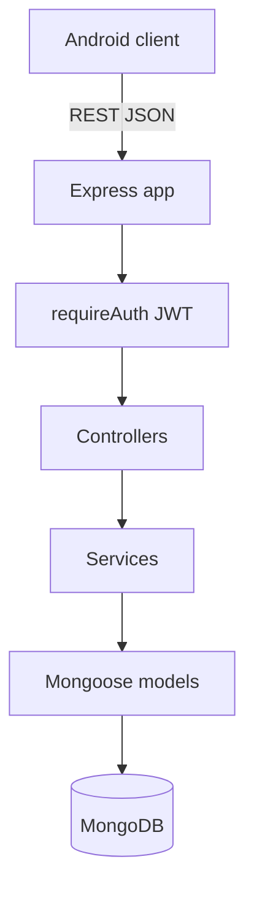
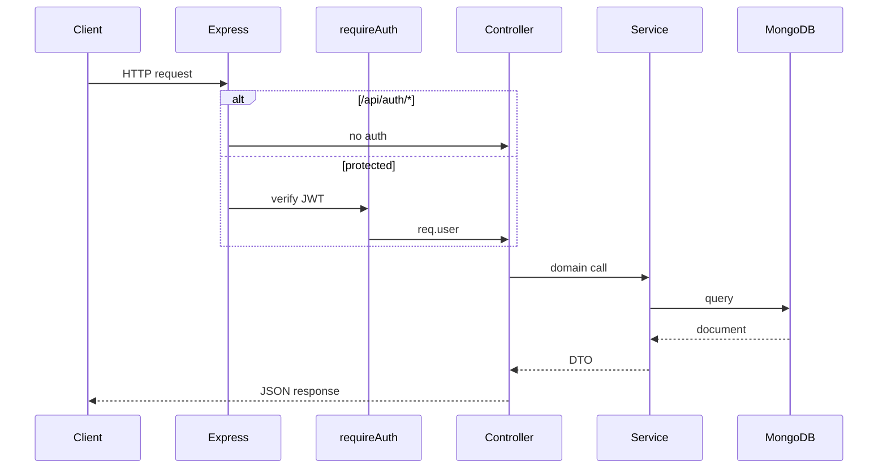
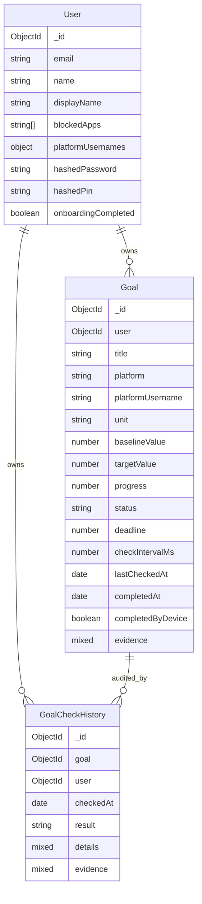
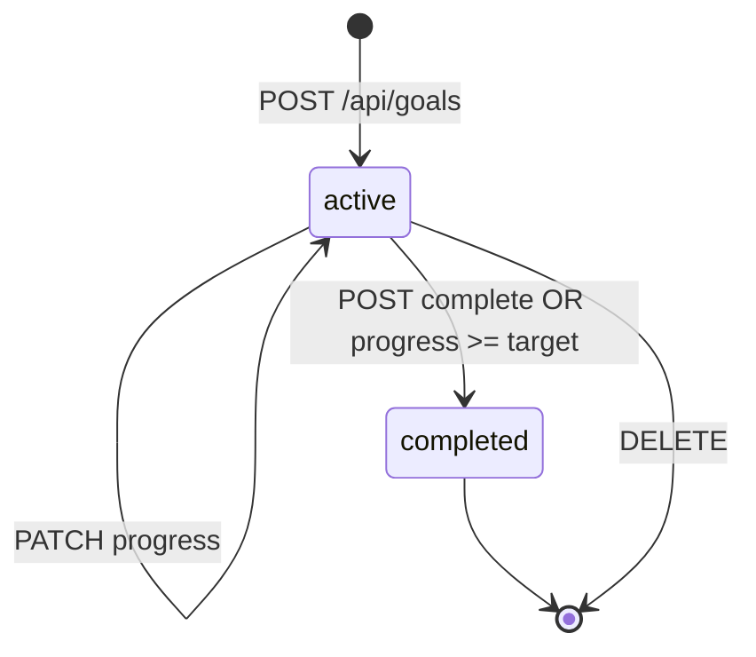

# Backend — Architecture

Express + TypeScript + MongoDB API for the Regretnt Android client.

**Path:** `backend/src/`  
**Entry:** `index.ts` → `app.ts` → routes under `/api`

---

## HLD



---

## Layer responsibilities

| Layer | Path | Role |
|-------|------|------|
| Routes | `routes/*.routes.ts` | HTTP mapping, rate limits |
| Controllers | `controllers/*.controller.ts` | Request/response, status codes |
| Services | `services/*.service.ts` | Business logic, DB access |
| Models | `models/*.model.ts` | Mongoose schemas |
| Middleware | `middleware/auth.ts`, `errorHandler.ts` | JWT verify, errors |
| Utils | `utils/validators.ts`, `goalDto.ts`, `jwt.ts`, `hash.ts` | Zod, DTO mapping, crypto |

---

## Request lifecycle



---

## Data model (ER)



**Relationships:**

- Goals reference `user` ObjectId.
- Blocked apps are embedded on **User** (`blockedApps: string[]`), not a separate collection.
- `GoalCheckHistory` rows created on **completion** (`markComplete`), not on every progress PATCH.

---

## Authentication

- **Register:** `POST /api/auth/register` — bcrypt password, optional server PIN hash.
- **Login:** `POST /api/auth/login` — email + password required.
- **JWT:** `signJwt({ sub: userId, email })`, default expiry `7d` (`JWT_SECRET`, `JWT_EXPIRES_IN`).
- **Middleware:** `requireAuth` reads `Authorization: Bearer <token>`, attaches `req.user`.

Device unlock PIN used by Android is **local** (`PINManager`); server `hashedPin` is optional at register and not used by current Android unlock flow.

---

## Goal lifecycle (server)



**Progress update** (`updateGoalProgress`):

```
computedProgress = max(0, currentValue - baselineValue)
if computedProgress >= targetValue → markComplete(via: progressUpdate)
else → save progress
```

**Complete** (`markComplete`):

- Sets `status = completed`, `completedAt`, bumps `progress` to at least `targetValue`
- Writes `GoalCheckHistory` with `result: 'completed'`

---

## Validation philosophy

| Validated server-side | Not validated server-side |
|----------------------|---------------------------|
| JWT, Zod on create/register | LeetCode/Duolingo activity |
| ObjectId format | Truth of client-reported progress |
| Numeric progress type | Deadline enforcement |
| Rate limits on complete | Platform username correctness |

Client-side LeetCode GraphQL validation is **by design**; backend persists trusted snapshots.

---

## Rate limiting

| Endpoint | Config | Default |
|----------|--------|---------|
| Auth routes | `AUTH_RATE_LIMIT_*` | 20 / 15 min |
| `POST /api/goals/:id/complete` | `GOAL_COMPLETE_RATE_LIMIT_*` | 30 / 1 min |

Progress PATCH is not rate-limited.

---

## Configuration

Environment (`.env`):

| Variable | Purpose |
|----------|---------|
| `MONGO_URI` | MongoDB connection |
| `JWT_SECRET` | Signing key |
| `JWT_EXPIRES_IN` | Token TTL |
| `PORT` | Server port (default 3000) |
| `ALLOWED_ORIGINS` | CORS |
| `BCRYPT_SALT_ROUNDS` | Password hashing |
| `GOAL_COMPLETE_RATE_LIMIT_*` | Complete endpoint throttle |

---

## File map

```
backend/src/
├── app.ts                 # Express setup, CORS, routes mount
├── index.ts               # Listen, DB connect
├── config.ts              # Env constants
├── controllers/
│   ├── auth.controller.ts
│   ├── goals.controller.ts
│   ├── user.controller.ts
│   └── dashboard.controller.ts
├── services/
│   ├── goals.service.ts
│   └── user.service.ts
├── models/
│   ├── user.model.ts
│   ├── goal.model.ts
│   └── goalCheckHistory.model.ts
├── routes/
│   ├── index.ts           # /api mount
│   ├── auth.routes.ts
│   ├── goals.routes.ts
│   ├── user.routes.ts
│   └── dashboard.routes.ts
├── middleware/
│   ├── auth.ts
│   └── errorHandler.ts
└── utils/
    ├── validators.ts      # Zod schemas
    ├── goalDto.ts           # Response mappers
    ├── jwt.ts
    └── hash.ts
```

---

## Dashboard aggregation

`GET /api/dashboard`:

```javascript
{
  goals: await goalSvc.listGoalsForUser(userId),
  blockedApps: toBlockedAppDtos(await userSvc.getBlockedApps(userId))
}
```

Single round-trip for Android `DashboardRepository`.

---

## Known gaps / TODOs

| Item | Notes |
|------|-------|
| `completeGoalSchema` | Defined in validators, not wired in controller |
| `lastCheckedAt` | Field exists; never updated in services |
| `completedByDevice` | Supported in model; Android does not send |
| Progress audit | No `GoalCheckHistory` on PATCH |
| Server-side platform verify | Out of scope for MVP |

---

## Related docs

- [API reference](api-reference.md)
- [Backend README](../../backend/readme.md)
- [System overview](../architecture/system-overview.md)
- [Android goal validation](../android/goal-validation.md)
