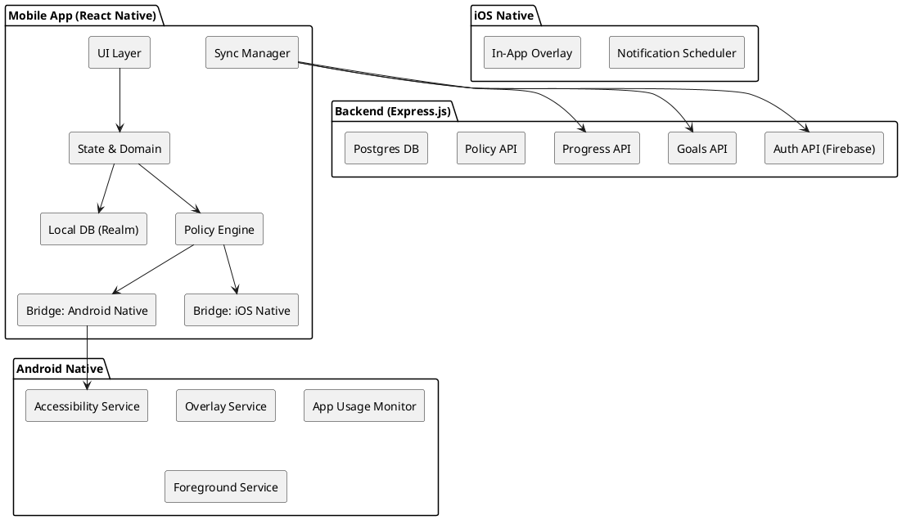
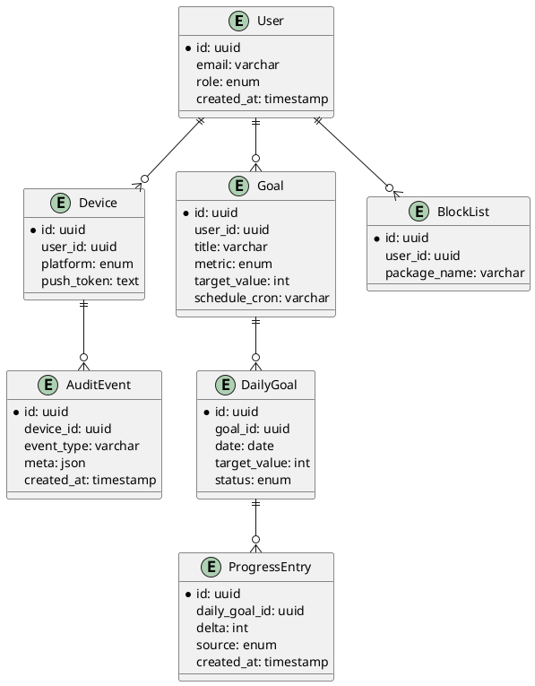

# SPEC-1-Oblique — Full Context

## Background

Oblique is a cross‑platform mobile product that enforces a user’s self‑development goals by restricting access to distracting apps (primarily on Android) and using persuasive prompts on iOS. The core idea is: until a user completes the configured daily goal (e.g., solve N DSA problems, complete concept modules, learn vocabulary, etc.), Oblique either blocks chosen apps with an overlay/Accessibility gate or periodically nudges the user with guilt‑trip messaging. Goals can be configured by the user or a parent (for children’s devices). The app caches today’s and upcoming goals for offline continuity, persists partial progress, and syncs profiles, goals, progress, and blocking configurations to a cloud backend. Shared React Native UI; platform‑specific native services (Android Accessibility/overlays; iOS push/limited overlays).

---

## Requirements (MoSCoW)

### Must Have
- Cross-platform RN UI in TypeScript.
- Android strict enforcement (Accessibility + overlay). iOS nudging-only (placeholder for future).
- Local DB cache (today + 2 days), blocklist, partial progress.
- Cloud backend: Express.js + Postgres; auth via Firebase Auth.
- Zustand for state; Realm for local data.
- Parental features, audit trail, push via FCM.

### Should Have
- Whitelist emergency apps.
- Streaks and rewards.
- Deep linking from notifications.

### Could Have
- AI-generated prompts.
- Smart block suggestions.

### Won’t Have (MVP)
- True iOS app blocking.

---

## Architecture (PlantUML)



---

## ER Diagram (PlantUML)



---

## Key Flows

**App Blocking (Android)**  
Accessibility detects app → Blocklist check → Goal status check → Show overlay → Log audit.

**Goal Lifecycle**  
Materialize daily goals at midnight → Save to Realm → Sync when online → Mark complete.

---

## Folder Structure

```
/oblique-monorepo
├── apps
│   ├── mobile
│   │   ├── android                # Native Android code
│   │   ├── ios                     # Native iOS code (placeholder)
│   │   ├── src
│   │   │   ├── assets
│   │   │   ├── components          # Pure UI components
│   │   │   ├── modules
│   │   │   │   ├── device-api      # Platform bridges
│   │   │   │   │   ├── android
│   │   │   │   │   └── ios
│   │   │   │   ├── local-db        # Realm schemas & repositories
│   │   │   │   └── cloud-sync
│   │   │   ├── services
│   │   │   ├── store               # Zustand stores
│   │   │   ├── hooks
│   │   │   ├── navigation
│   │   │   ├── utils
│   │   │   ├── App.tsx
│   │   │   └── index.js
│   │   ├── package.json
├── backend
│   ├── src
│   │   ├── controllers
│   │   ├── routes
│   │   ├── services
│   │   ├── db
│   │   ├── utils
│   │   └── index.js
│   ├── package.json
├── libs
│   ├── api-client
│   └── types
├── infra
│   └── docker-compose.yml
└── scripts
```

---

## package.json — Mobile

```json
{
  "name": "oblique-mobile",
  "version": "1.0.0",
  "private": true,
  "scripts": {
    "android": "react-native run-android",
    "start": "react-native start",
    "test": "jest",
    "lint": "eslint ."
  },
  "dependencies": {
    "@react-native-async-storage/async-storage": "^1.21.0",
    "@react-native-firebase/app": "^19.0.1",
    "@react-native-firebase/auth": "^19.0.1",
    "@react-native-firebase/messaging": "^19.0.1",
    "@react-navigation/native": "^6.1.9",
    "@react-navigation/stack": "^6.3.20",
    "axios": "^1.6.8",
    "react": "18.2.0",
    "react-hook-form": "^7.51.3",
    "react-native": "0.81.0",
    "react-native-gesture-handler": "^2.14.0",
    "react-native-permissions": "^3.10.1",
    "react-native-reanimated": "^3.6.2",
    "react-native-safe-area-context": "^4.9.0",
    "react-native-screens": "^3.31.1",
    "realm": "^12.6.0",
    "yup": "^1.3.2",
    "zustand": "^4.5.2"
  }
}
```

---

## package.json — Backend

```json
{
  "name": "oblique-backend",
  "version": "1.0.0",
  "main": "src/index.js",
  "type": "module",
  "scripts": {
    "dev": "nodemon src/index.js",
    "start": "node src/index.js"
  },
  "dependencies": {
    "axios": "^1.6.8",
    "cors": "^2.8.5",
    "dotenv": "^16.4.0",
    "express": "^4.19.2",
    "firebase-admin": "^12.4.0",
    "helmet": "^7.1.0",
    "morgan": "^1.10.0",
    "pg": "^8.11.3",
    "prisma": "^5.9.1"
  }
}
```

---

## Shared UI Guidance

Both Android and iOS native folders (`android/app/src` and `ios/<project>`) are for native-only code (services, permissions, configs).  
Your **shared RN code** (UI, logic, hooks, Zustand stores, Realm schemas, services) lives in `mobile/src`.  
`index.js` imports `src/App.tsx` so both platforms run from the same entry point.

**Example `index.js`**:
```javascript
import {AppRegistry} from 'react-native';
import App from './src/App';
import {name as appName} from './app.json';

AppRegistry.registerComponent(appName, () => App);
```
